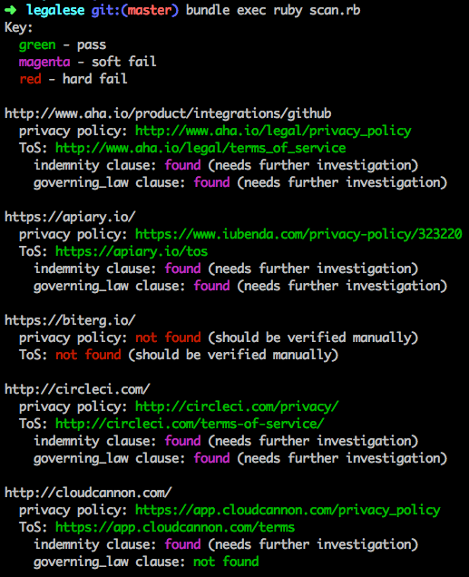

# Legalese [](https://travis-ci.org/18F/legalese)

Experimental checker for legal text that determines whether 18F can use a third-party service or not. Checks the following:

* If the site has a Privacy Policy
* If the site has a Terms of Service, and if it contains the following clauses:
    * [Governing law](http://www.contractstandards.com/clauses/governing-law)
    * [Indemnification](http://www.startuplawtalk.com/what-is-indemnification/)



## Usage

Requires Ruby 1.9+.

1. Clone this repository and `cd` into the directory.
1. Create a `urls.txt` file with a list of sites to check, one on each line. For example, 
    ```bash
		http://www.aha.io/product/integrations/github
		https://apiary.io/
		https://biterg.io/
		http://circleci.com/
		http://cloudcannon.com/
		https://codeclimate.com/
		https://codecov.io/
		https://coveralls.io/
		https://hub.docker.com/
		https://floobits.com/
		https://gemnasium.com/
		https://desktop.github.com/
		https://government.github.com/
		https://gitter.im/
		https://hakiri.io/
		https://hakiri.io/
		https://houndci.com/
		https://huboard.com/
		https://www.quantifiedcode.com/
		https://readthedocs.org/
		https://slack.com/
		https://snap-ci.com/
		https://snyk.io/
		https://travis-ci.org/
		https://travis-ci.com/
		https://trello.com/
		https://waffle.io/
		http://wercker.com/
		https://www.zenhub.io/

    ```
1. Run

    ```bash
    bundle
    bundle exec ruby scan.rb
    ```
